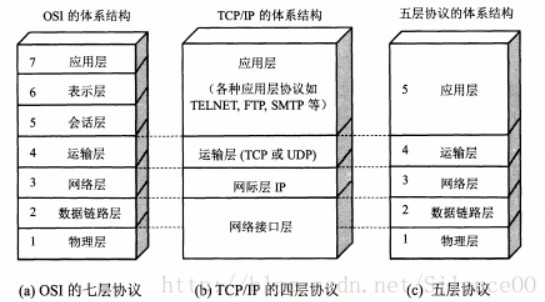
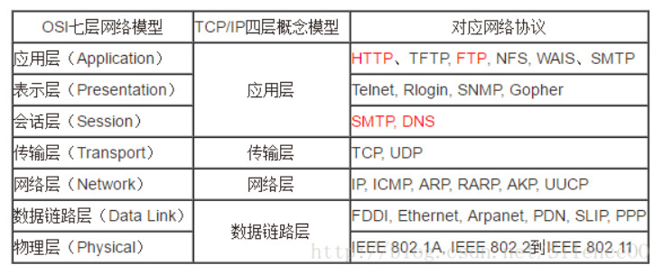

1. 负载均衡原理
    
2. 数据库连接池调优
3. Hadoop cluster搭建过程
4. docker 容器应用
5. 监控的搭建和配置
6. OSI模型:七层模型(OSI: Open System Interconnection)
    1. 
    2. 
7. SYN 请求
8. HTTP 5层模型(From:https://blog.csdn.net/qq_22238021/article/details/80279001)  
    1. 应用层application layer
        体系中最高的层。直接为用户的应用进程(例如电子邮件，文件传输，终端仿真)提供服务。  
        在internet中的应用层协议很多，比如HTTP协议，SMTP协议，FTP,DNS,POP3,SNMP等协议
    2. 运输层transport layer
        负责向两个主机中进程之间的通信提供服务。由于一个主机可同时运行多个进程，因此运输层有复用和分用的功能  
        复用：多个应用层进程可同时使用下面运输层的服务
        分用：把收到的信息分别交给上面应用层相应的进程
        运输层主要使用两种协议：
        a. 传输控制协议TCP(Transmission Control Protocal):面向连接的，数据传输的单位是报文段，能够提供可靠的交付。
        b. 用户数据包协议UDP(User Datagram Protocal): 无连接的，数据传输的单位是用户数据报，不保证提供可靠的交付，只能
        尽最大努力交付。
    3. 网络层network layer
        主要包括连个任务：a. 负责为分组交换网上的不同的主机提供通信服务。在发送数据时候，网络层把运输层产生的报文段
        或者用户数据封装成分组或者包进行传送。在TCP/IP体系中，由于网络层使用IP协议，因此分组也叫作IP数据报或者简称为
        数据报。 b. 选中合适的路由，是源主机运输层所传下来的分组能够通过网络中的路由找到目的主机。  
        协议: IP, ICMP, IGMP, ARP, RARP
    4. 数据链路层 Data link layer
        简称为链路层，我们知道两个主机之间的数据传输，总是一段一段的链路上传送的，也就是说，在两个相邻的节点之间
        传送数据是直接传送(点对点)，这时就需要专门的链路层的协议。  
        两个相邻的节点之间传送数据时，数据链路层将网络层交下来的IP数据报组装成帧(framing)，在两个相邻节点之间的链路
        上“透明”地传送帧中的数据。  
        每一帧包括数据和必要的控制信息(比如同步信息，地址信息，差错控制等)。典型的帧的长度是几百字节到一千多字节。  
        注：”透明”是一个很重要的术语。它表示，某一个实际存在的事物看起来却好像不存在一样。”在数据链路层透明传送数据”
        表示无力什么样的比特组合的数据都能够通过这个数据链路层。
        因此，对所传送的数据来说，这些数据就“看不见”数据链路层。或者说，数据链路层对这些数据来说是透明的。
        (1)在接收数据时，控制信息使接收端能知道一个帧从哪个比特开始和到哪个比特结束。这样，数据链路层在收到一个帧后，
        就可从中提取出数据部分，上交给网络层。 
        (2)控制信息还使接收端能检测到所收到的帧中有无差错。如发现有差错，数据链路层就简单地丢弃这个出了差错的帧，
        以免继续传送下去白白浪费网络资源。如需改正错误，就由运输层的TCP协议来完成。
    5. 物理层 phsical layer
        在物理层上所传数据的单位是比特。物理层的任务就是透明地传送比特流。
    
9. TCP 和 UDP 区别

10. 三种模型的对应关系  
    
    
11. DNS  
    Domain Name System: 互联网的一项服务。它作为域名和IP地址的相互映射的一个分布式数据库，能够使人更方便的相互访问互联网。
    DNS使用TCP和UDP端口53.当前，每一级域名的长度限制是63个字符，域名总长度不能超过253个字符。
